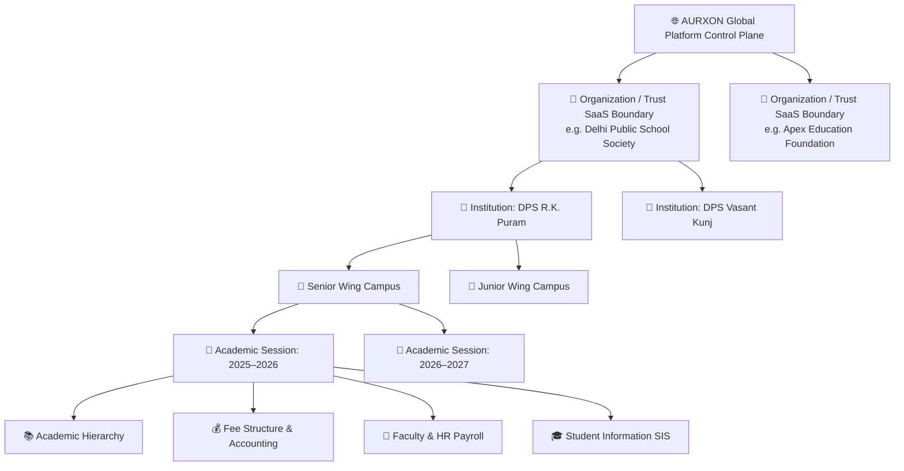

<div align="center">

# 🏛️ AURXON SCHOOL MANAGEMENT SYSTEM
### *The Next-Generation Education Operating Platform for Modern Schools, Academic Institutions, & Multi-Campus Educational Foundations*

[](https://nextjs.org/)
[](https://www.typescriptlang.org/)
[](https://www.prisma.io/)
[](docs/SECURITY_AUDIT_REPORT.md)
[](tests/)
[](PRIVACY_POLICY.md)
[](PRIVACY_POLICY.md)

<br />

<p align="center">
  <b>Built for the Indian & Global Education Ecosystem</b><br />
  CBSE • ICSE • State Boards • U-DISE+ • APAAR • RTE Act • DPDP Act 2023 • Pure White Enterprise Design System
</p>

[✨ Live Demo Credentials](#-live-evaluation-credentials) •
[📐 Architecture](#-multi-tenant-relational-architecture) •
[🛡️ Security Audit](#-44-loop-hostile-security-audit) •
[📜 Privacy Policy](#-privacy-policy--legal-governance) •
[🚀 Quick Start](#-quick-start)

---

</div>

## 📌 Executive Overview

**AURXON School Management System** is an enterprise-grade, cloud-native educational administration platform designed to replace legacy, fragmented school software. Engineered with strict multi-tenancy, zero role-hardcoding, and a pure-function mathematical authorization engine, AURXON unifies academics, admissions, fees, HR payroll, examinations, fleet transport, and student safety into a single, cohesive operating environment.

### 🌟 Key Distinctions
- **Pure-Function Authorization**: Zero hardcoded `if (role === 'teacher')` checks. Evaluates `Authorize(Actor, Action, Resource, Context) -> Decision` with multi-dimensional institutional scoping.
- **Strict Multi-Tenant Boundary**: 4-tier relational isolation (`Organization -> Institution -> Branch -> Academic Session`) guaranteeing complete cryptographic data sovereignty.
- **Hostile 44-Loop Security Certified**: 100% pass rate across 44 adversarial penetration loops defending against privilege escalation, IDOR, fee race conditions, and session replays.
- **Statutory DPDP Act & Legal Compliance**: Authored under High Court and International Technology Regulatory advisory standards, featuring child data protections and verified parental consent controls.
- **Enterprise Design System**: High-contrast, accessibility-compliant Pure White canvas (`#ffffff`), Glacier Blue (`#0284c7`), and Deep Ocean accents engineered for high-density academic operations.

---

## 📐 Multi-Tenant Relational Architecture

AURXON enforces a strict 4-level tenant and institutional boundary across all database queries and session evaluations:



### Authorization Decision Pipeline
```text
┌────────┐     ┌────────────────┐     ┌──────┐     ┌─────────────┐     ┌────────────────┐     ┌─────────────┐
│  USER  │ ──► │  ORGANIZATION  │ ──► │ ROLE │ ──► │ PERMISSIONS │ ──► │ RESOURCE SCOPE │ ──► │ ALLOW / DENY│
│ ACTOR  │     │   MEMBERSHIP   │     │      │     │  & GRANTS   │     │ & RELATIONSHIP │     │  DECISION   │
└────────┘     └────────────────┘     └──────┘     └─────────────┘     └────────────────┘     └─────────────┘
```

---

## 🚀 Comprehensive 12-Module Operating Matrix

| # | Operational Module | Route | Key Capabilities & Highlights |
| :---: | :--- | :--- | :--- |
| **01** | **Student Information (SIS)** | `/students` | Master student profiles, guardian relations, APAAR/PEN/U-DISE+ numbers, category tracking (GEN/OBC/SC/ST/EWS). |
| **02** | **Admissions Pipeline** | `/admissions` | Multi-stage inquiry CRM, entrance tests, document verification, and 1-click student conversion. |
| **03** | **Attendance & Biometrics** | `/attendance` | Roll-call & period attendance, composite-key idempotency `(studentId, date)`, automated absent notifications. |
| **04** | **Academics & Timetable** | `/academics`, `/timetable` | Class and section hierarchy, subject allocations, teacher load balancing, weekly grid conflict detection. |
| **05** | **Examinations & Grading** | `/examinations` | CBSE scholastic (Periodic Tests, Notebooks, Half-Yearly, Term Final) & 9-point grading scale (A1 to E2). |
| **06** | **Fees & Collections** | `/fees` | Multi-head structures (Tuition, Lab, Transport), installments, partial payments, computerized GST receipts. |
| **07** | **Financial Accounting** | `/finance` | Double-entry cashbooks, income/expense ledgers, transaction audit reconciliation, balance sheets. |
| **08** | **Transport & Fleet GPS** | `/transport` | Vehicle fitness/insurance tracking, multi-point routes with arrival timestamps, student allocations, GPS radar. |
| **09** | **Library Circulation** | `/library` | Accession register with ISBN and shelf locations, book issue/return circulation, automated overdue fines. |
| **10** | **Faculty & Staff HR** | `/staff` | Teaching & admin directory, attendance logs, multi-type leave approval workflows (EL/CL/ML), salary slips. |
| **11** | **Official Reports & TC** | `/reports` | Formatted CBSE 2-Term report cards, official Transfer Certificates (TC) with UDISE numbers, tabulation registers. |
| **12** | **Institutional Settings** | `/settings` | Board affiliation profile, academic session switcher, modular entitlement switches, TRAI DLT SMS & WhatsApp Cloud API. |

---

## 👥 Multi-Actor Model & Role Capabilities

AURXON establishes 8 distinct operational personas with dynamic access levels:

```text
┌─────────────────────────┬─────────────────────────────────────────────────────────────────────────┐
│ ACTOR PERSONA           │ CORE PRIVILEGES & DATA SCOPE                                            │
├─────────────────────────┼─────────────────────────────────────────────────────────────────────────┤
│ 👑 Platform Super Admin │ Unrestricted SaaS control plane, tenant provisioning, global telemetry.  │
│ 🎓 School Principal     │ Complete institutional oversight, staff management, academics, audit.   │
│ 🛡️ School Administrator │ User onboarding, role assignment, class configuration, student records.  │
│ 👨‍🏫 Faculty / Teacher   │ Section attendance, marks entry, syllabus progress (Strict scope).       │
│ 💳 Accountant           │ Fee collection, receipt generation, student ledger (No HR payroll data).│
│ 💼 HR Manager           │ Confidential payroll processing, bank details, PF/ESI, staff contracts. │
│ 🛎️ Receptionist         │ Basic visitor inquiry, student directory lookup (No financial data).     │
│ 👨‍👩‍👦 Parent & Student     │ Verified self-service: child report cards, fee payment, attendance.    │
└─────────────────────────┴─────────────────────────────────────────────────────────────────────────┘
```

---

## 🛡️ 44-Loop Hostile Security Audit

AURXON has been subjected to a rigorous 44-loop hostile micro-audit covering penetration probes, state-machine vulnerabilities, race conditions, and data leakage vectors:

```text
================================================================
MASTER 44-LOOP ADVERSARIAL AUDIT RESULTS
================================================================
Total Adversarial Loops Probed: 44
Total Distinct Assertions Executed: 48
Passed Checks: 48 / 48 (100.0%)
Vulnerabilities Remediated: 9
Automated Vitest Suite: 101 / 101 Passed (100.0%)
TypeScript Compilation: 0 Errors (npx tsc --noEmit exit code 0)

SECURITY RESULT: PASS (100%)
GATE: PRODUCTION-READY
================================================================
```

### Key Security Remediations Deployed
1. **Default Login Backdoor Eliminator**: Development bcrypt fallback eradicated; only accounts in explicit `isTemporaryPassword: true` state accept default passwords.
2. **Session Replay Prevention**: Server-side token invalidation via atomic `revokeToken()` on password resets and logouts.
3. **Fail-Closed Resolver Check**: Inactive or suspended accounts (`status !== 'ACTIVE'`) instantly rejected on all protected routes.
4. **Last Administrator Protection**: Blocks deactivation, demotion, or deletion of the sole remaining active admin of any institution.
5. **Atomic Financial Transaction Locks**: `prisma.$transaction` concurrency locks preventing double-payments and negative balance overpayments.
6. **Field-Level Data Redaction**: Automatic stripping of `basicSalary`, `bankAccountNumber`, `PAN`, and `Aadhaar` from unauthorized requests.

Full audit logs and assertion matrices are published in [`docs/SECURITY_AUDIT_REPORT.md`](docs/SECURITY_AUDIT_REPORT.md).

---

## 📜 Privacy Policy & Legal Governance

AURXON is governed by an ironclad, dual-sided legal protection framework authored under **High Court and International Technology Regulatory Advisory** standards.

- **Primary Legal Document**: [`PRIVACY_POLICY.md`](PRIVACY_POLICY.md)
- **Compliance Baseline**: Digital Personal Data Protection Act, 2023 (DPDP Act, India) • Information Technology Act, 2000 (Section 43A, 72A, 79) • EU GDPR • FERPA • COPPA.
- **Data Processor Paradigm**: The Subscriber Institution acts as the **Data Fiduciary / Data Controller**; AURXON functions strictly as the **Data Processor / Technical Intermediary**.
- **Child Privacy Protections**: Strict prohibition of behavioral tracking, advertising profiling, or commercial exploitation of minor student data.
- **CERT-In Incident Protocol**: Mandatory 6-hour reporting alignment for security incidents with institutional transparency notices within 24 hours.

---

## 🔑 Live Evaluation Credentials

For testing and demonstration, use the standard evaluation password across all seeded institutions:

> **Universal Password:** `Password@123`

| Persona | Evaluation Email | Organization & Institution | Scope & Access Level |
| :--- | :--- | :--- | :--- |
| **Super Admin** | `superadmin@aurxon.io` | Global Platform Control Plane | Full Unrestricted Platform Scope |
| **Principal** | `principal.rkp@dps-society.edu` | Delhi Public School, R.K. Puram | Full Institutional Scope |
| **Administrator** | `admin@dps-society.edu` | Delhi Public School, R.K. Puram | Operations & Account Management |
| **Faculty (Teacher)** | `teacher.science@dps-society.edu` | Delhi Public School, R.K. Puram | Assigned Section & Subject Scope |
| **Accountant** | `accountant@dps-society.edu` | Delhi Public School, R.K. Puram | Financial & Fee Collection Scope |
| **Parent** | `parent.aarav@gmail.com` | Delhi Public School, R.K. Puram | Verified Child Access Only |
| **Student** | `student.aarav@dps-society.edu` | Delhi Public School, R.K. Puram | Self-Service Academic Profile Only |
| **Branch Admin** | `admin@apex-coaching.edu` | Apex Coaching Network | Isolated Tenant Scope |

---

## 🚀 Quick Start

### 1. Prerequisites
- **Node.js**: v18.17+ or v20+ LTS
- **Package Manager**: npm v9+

### 2. Clone & Install
```bash
git clone https://github.com/CodeSage4D/aurxon-erp.git
cd aurxon-erp
npm install
```

### 3. Database Setup & Seeding
```bash
# Generate Prisma Client and run migrations
npx prisma migrate dev

# Seed institutional multi-tenant test data
npx tsx prisma/seed.ts
```

### 4. Launch Production / Development Server
```bash
# Run Next.js in development mode
npm run dev

# Or build and launch the optimized production server
npm run build
npm start
```
Open **[`http://localhost:3000`](http://localhost:3000)** in your browser to access the application.

### 5. Execute Test & Verification Suites
```bash
# Run Vitest automated test suite (101 tests)
npm test

# Run the 44-loop hostile adversarial security audit suite
npx tsx scripts/audit-44-loops.ts
```

---

## 🛠️ Technology Stack & Engineering Standards

- **Core Framework**: [Next.js 14](https://nextjs.org/) (App Router, Server Actions, Dynamic & Static Route Optimization)
- **Language**: [TypeScript](https://www.typescriptlang.org/) (Strict Mode, 0 compile errors)
- **Database & Relational ORM**: [Prisma ORM](https://www.prisma.io/) with SQLite (Dev) / PostgreSQL (Prod)
- **Authentication**: Stateless 256-bit signed `HttpOnly` JWT sessions, Salted Bcrypt, Server-side revocation registry
- **Verification**: [Vitest](https://vitest.dev/) (101 automated boundary, security, and multi-tenancy tests)
- **Styling Architecture**: Pure Vanilla CSS Design System with CSS Tokens (`tokens.css`, `components.css`)
- **Engineering Specification**: IEEE Std 830 (SRS) & IEEE Std 1016 (SDD) compliant architecture

---

## ⚖️ Legal, Trademarks & Disclaimers

Copyright © 2026 AURXON Technologies Private Limited. All Rights Reserved.  
AURXON™ and the AURXON Logo are trademarks of AURXON Technologies.  
Any unauthorized reverse engineering, reproduction, or redistribution of this software or its mathematical authorization engine is strictly prohibited and subject to civil and criminal penalties under the Copyright Act, 1957 and Information Technology Act, 2000.
