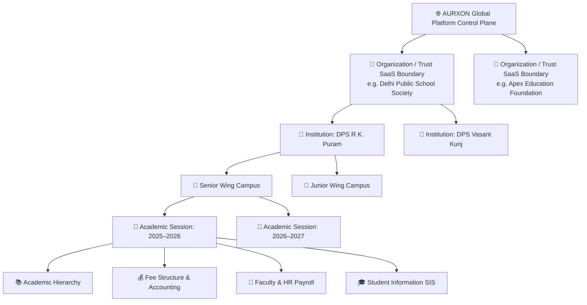

<div align="center">

# 🏛️ AURXON EDUVAULT
### *The Education Operating Platform for Modern Schools, Academic Institutions, & Multi-Campus Foundations*

[](https://nextjs.org/)
[](https://www.typescriptlang.org/)
[](https://www.prisma.io/)
[](android/)
[](docs/audit/AURXON_EDUVAULT_OMEGA_REPORT.md)
[](tests/)

<br />

<p align="center">
  <b>"One Platform. Every Institution. Every Operation."</b><br />
  CBSE • ICSE • State Boards • U-DISE+ • APAAR • RTE Act • DPDP Act 2023 • Web ERP + Native Android Mobile
</p>

[✨ Live Demo Credentials](#-live-evaluation-credentials) •
[📐 Architecture](#-multi-tenant-relational-architecture) •
[📱 Native Android Platform](#-native-android-mobile-platform) •
[🛡️ Security Audit](#-omega-red-team-security-audit) •
[📜 Privacy Policy](#-privacy-policy--legal-governance) •
[🚀 Quick Start](#-quick-start)

---

</div>

## 📌 Executive Overview

**AURXON EDUVAULT** is an enterprise-grade education operating platform unifying web administration and native mobile applications. Built for K-12 schools, coaching institutes, and multi-campus foundations, AURXON EDUVAULT enforces strict multi-tenancy, server-authoritative ABAC authorization, and automated institutional operations across academics, admissions, fees, HR payroll, examinations, fleet transport, and student safety.

### 🌟 Key Distinctions
- **Pure-Function ABAC Engine**: Evaluates `authorize(actor, permission, resource)` with multi-dimensional institutional scoping.
- **Strict Multi-Tenant Boundary**: 4-tier relational isolation (`Organization -> Institution -> Branch -> Academic Session`).
- **Web + Native Android Ecosystem**:
  - **Web ERP**: Full operational hub for desktop & tablet administration.
  - **AURXON EDU (Native Android)**: Dedicated mobile experience for Parents & Students.
  - **AURXON STAFF (Native Android)**: Dedicated mobile experience for Teachers, Faculty & Management.
- **Hostile OMEGA Red Team Certified**: Verified pass across Alpha, Beta, and Gamma adversary attack vectors.
- **DPDP Act 2023 Compliant**: Child privacy protections, verified parental consent controls, and field-level sensitive data sanitization.

---

## 📱 Native Android Mobile Platform

AURXON EDUVAULT contains a dedicated top-level `/android` workspace with native Kotlin Jetpack Compose applications:

```text
android/
├── shared/            # Shared Kotlin models, API client & session security
├── AURXON_EDU/        # Native Parent & Student Android Application (com.aurxon.edu)
├── AURXON_STAFF/      # Native Faculty & Management Android Application (com.aurxon.staff)
├── settings.gradle.kts
└── README.md
```

### Build Commands:
```bash
cd android
export JAVA_HOME=/home/karann/.jdks/jdk-21.0.4+7
export ANDROID_HOME=/home/karann/Android/Sdk

./gradlew assembleDebug
```

---

## 📐 Multi-Tenant Relational Architecture



---

## 🚀 Comprehensive 12-Module Operating Matrix

| # | Operational Module | Route | Key Capabilities & Highlights |
| :---: | :--- | :--- | :--- |
| **01** | **Student Information (SIS)** | `/students` | Master student profiles, guardian relations, APAAR/PEN/U-DISE+ numbers, category tracking. |
| **02** | **Admissions Pipeline** | `/admissions` | Multi-stage inquiry CRM, entrance tests, document verification, and 1-click conversion. |
| **03** | **Attendance & Biometrics** | `/attendance` | Roll-call & period attendance, section preselection, automated absent notifications. |
| **04** | **Academics & Timetable** | `/academics`, `/timetable` | Class/section hierarchy, subject allocations, teacher load balancing, grid conflict detection. |
| **05** | **Examinations & Grading** | `/examinations` | CBSE scholastic & 9-point grading scale (A1 to E2), bulk report card generation. |
| **06** | **Fees & Collections** | `/fees` | Configurable late fee policies (daily/percentage), installments, partial payments, receipts. |
| **07** | **Financial Accounting** | `/finance` | Double-entry cashbooks, income/expense ledgers, transaction audit reconciliation. |
| **08** | **Transport & Fleet GPS** | `/transport` | Vehicle fitness/insurance tracking, multi-point routes, student allocations. |
| **09** | **Library Circulation** | `/library` | Accession register with ISBN, book issue/return circulation, automated overdue fines. |
| **10** | **Faculty & Staff HR** | `/staff` | Teaching & admin directory, attendance logs, leave approvals, salary slips. |
| **11** | **Official Reports & TC** | `/reports` | Formatted CBSE report cards, official Transfer Certificates (TC) with UDISE numbers. |
| **12** | **Institutional Settings** | `/settings` | Board affiliation profile, academic session switcher, modular entitlement switches. |

---

## 🔑 Live Evaluation Credentials

> **Universal Password:** `Password@123`

| Persona | Evaluation Email | Organization & Institution | Scope & Access Level |
| :--- | :--- | :--- | :--- |
| **Super Admin** | `superadmin@aurxon.io` | Global Platform Control Plane | Full Unrestricted Platform Scope |
| **Principal** | `principal.rkp@dps-society.edu` | Delhi Public School, R.K. Puram | Full Institutional Scope |
| **Administrator** | `admin@dps-society.edu` | Delhi Public School, R.K. Puram | Operations & Account Management |
| **Faculty (Teacher)** | `teacher.science@dps-society.edu` | Delhi Public School, R.K. Puram | Assigned Section & Subject Scope |
| **Accountant** | `accountant@dps-society.edu` | Delhi Public School, R.K. Puram | Financial & Fee Collection Scope |
| **Parent** | `parent.aarav@gmail.com` | Delhi Public School, R.K. Puram | Verified Child Access Only |
| **Student** | `student.aarav@dps-society.edu` | Delhi Public School, R.K. Puram | Self-Service Academic Profile Only |

---

## 🚀 Quick Start

### 1. Prerequisites
- **Node.js**: v18.17+ or v20+ LTS
- **JDK**: Java 17+ or 21 (for Android builds)
- **Android SDK**: API Level 35 (for Android builds)

### 2. Launch Web ERP Server
```bash
npm install
npx prisma migrate dev
npx tsx prisma/seed.ts
npm run dev
```

### 3. Execute Verification & Security Test Suites
```bash
# Run Vitest test suite (109 tests)
npm test

# Run TypeScript compilation check
npx tsc --noEmit

# Run Next.js production build
npm run build
```

---

## ⚖️ Legal & Trademarks

Copyright © 2026 AURXON Technologies Private Limited. All Rights Reserved.  
AURXON™ and EDUVAULT™ are trademarks of AURXON Technologies Private Limited.
